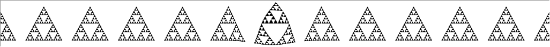
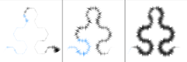
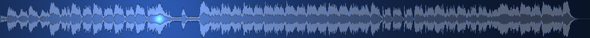
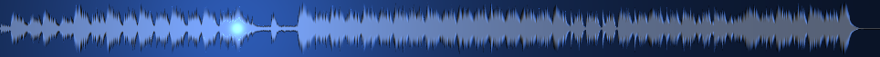
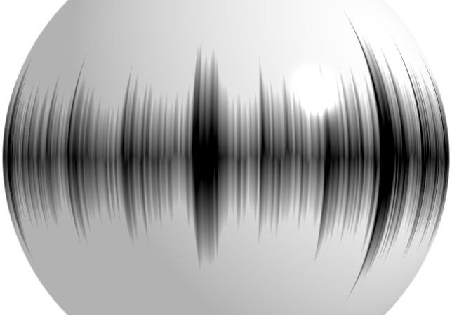

# Waveform Seekbar Effect Colletion

A collection of scripts for the Waveform Seekbar plugin for foobar2000, to be used with the Direct3D 9.0c frontend.

## Default

This is pretty much the default effect as far as I remember.

## Pacman

Animated mouth, chasing enemy, disappearing pills. Also a waveform in the background.

## Sierpinksi Triangle

An attempt to use recursive functions. "Error: recursive functions not implemented." Oh well. Takes ages to compile.

## Sierpinski Arrowhead Waveform

More fractal fun. A waveform drawn along the Sierpinski arrowhead curve. Best viewed in a large square panel.

 [(full size)](sierpinski-arrowwave.png)

## Bump Map

Raised or sunken waveform with phong shading.

Shade played on:

Shaded played off:

## Ball

Rotating ball. Recommend aspect ratio is 1.41421:1.

</img>
