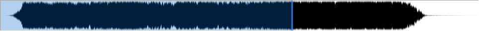
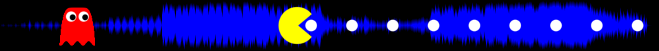

# Waveform Seekbar Effect Colletion

A collection of scripts for the Waveform Seekbar plugin for foobar2000, to be used with the Direct3D 9.0c frontend.

## Default

This is pretty much the default effect as far as I remember.

## Pacman

Animated mouth, chasing enemy, disappearing pills. Also a waveform in the background.

## Sierpinksi Triangle

An attempt to use recursive functions. "Error: recursive functions not implemented." Oh well. Takes ages to compile.

